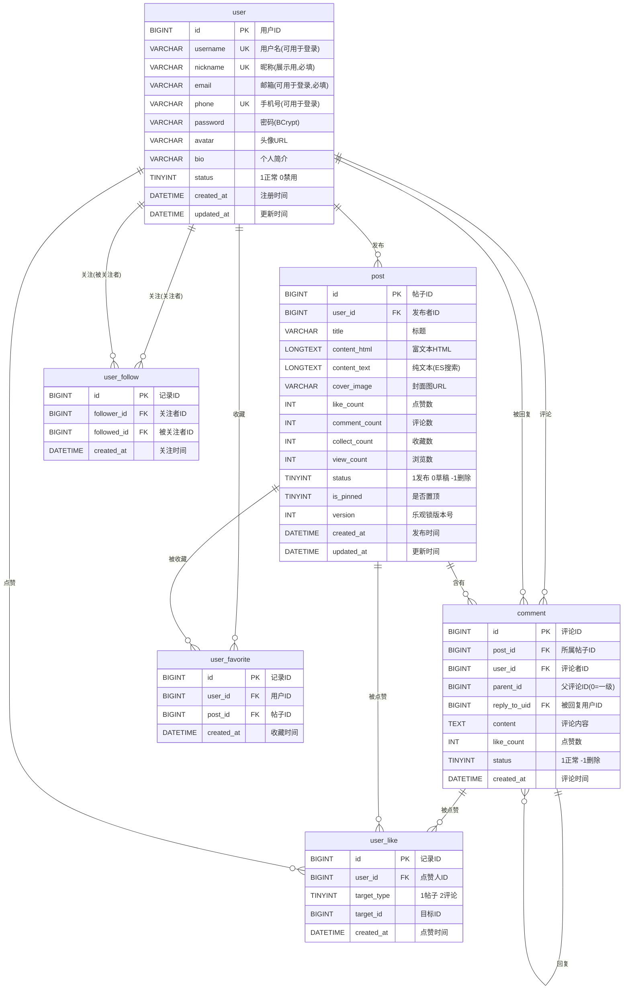

# EchoSpace 数据库设计文档

## 一、用户表 `user`

| 字段名 | 类型 | 主键 | 可为空 | 默认值 | 索引 | 备注 |
|--------|------|------|--------|--------|------|------|
| `id` | BIGINT | 是 | 否 | — | PRIMARY | 用户ID |
| `username` | VARCHAR(50) | 否 | 否 | — | UNIQUE | 用户名，可用于登录 |
| `nickname` | VARCHAR(50) | 否 | 否 | — | UNIQUE | 昵称（展示用，注册时随机生成，用户可自行修改） |
| `email` | VARCHAR(100) | 否 | 否 | — | INDEX UNIQUE | 邮箱，可用于登录 |
| `phone` | VARCHAR(20) | 否 | 否 | — | UNIQUE | 手机号，可用于登录 |
| `password` | VARCHAR(255) | 否 | 否 | — | — | 密码（BCrypt 加密） |
| `avatar` | VARCHAR(500) | 否 | 是 | NULL | — | 头像 URL |
| `bio` | VARCHAR(500) | 否 | 是 | NULL | — | 个人简介 |
| `status` | TINYINT | 否 | 否 | 1 | — | 1=正常, 0=禁用 |
| `created_at` | DATETIME | 否 | 否 | CURRENT_TIMESTAMP | — | 注册时间 |
| `updated_at` | DATETIME | 否 | 否 | CURRENT_TIMESTAMP ON UPDATE | — | 更新时间 |

---

## 二、帖子表 `post`

| 字段名 | 类型 | 主键 | 可为空 | 默认值 | 索引 | 备注 |
|--------|------|------|--------|--------|------|------|
| `id` | BIGINT | 是 | 否 | — | PRIMARY | 帖子ID |
| `user_id` | BIGINT | 否 | 否 | — | INDEX | 发布者ID |
| `title` | VARCHAR(200) | 否 | 否 | — | — | 帖子标题 |
| `content_html` | LONGTEXT | 否 | 否 | — | — | 富文本 HTML（Tiptap 输出） |
| `content_text` | LONGTEXT | 否 | 否 | — | FULLTEXT | 纯文本（用于 ES 搜索，jsoup 提取） |
| `cover_image` | VARCHAR(500) | 否 | 是 | NULL | — | 封面图（正文第一张图片） |
| `like_count` | INT | 否 | 否 | 0 | — | 点赞数（缓存字段，Redis 定时同步） |
| `comment_count` | INT | 否 | 否 | 0 | — | 评论数（缓存字段） |
| `collect_count` | INT | 否 | 否 | 0 | — | 收藏数（缓存字段） |
| `view_count` | INT | 否 | 否 | 0 | — | 浏览数 |
| `status` | TINYINT | 否 | 否 | 1 | INDEX(联合) | 1=已发布, 0=草稿, -1=已删除 |
| `is_pinned` | TINYINT | 否 | 否 | 0 | — | 是否置顶, 1=置顶, 0=普通 |
| `version` | INT | 否 | 否 | 0 | — | 乐观锁版本号 |
| `created_at` | DATETIME | 否 | 否 | CURRENT_TIMESTAMP | INDEX, INDEX(联合) | 发布时间 |
| `updated_at` | DATETIME | 否 | 否 | CURRENT_TIMESTAMP ON UPDATE | — | 更新时间 |

**索引汇总**：
- `INDEX idx_user_id (user_id)` — 按用户查询帖子
- `INDEX idx_created_at (created_at)` — 按时间排序
- `INDEX idx_status_created (status, created_at)` — 联合索引，首页列表查询
- `FULLTEXT INDEX ft_content (content_text)` — MySQL 全文索引（ES 不可用时的兜底）

---

## 三、评论表 `comment`

采用 **一级评论 + 二级回复** 模型：
- `parent_id = 0` 表示一级评论（直接回复帖子）
- `parent_id > 0` 表示二级回复（回复某条一级评论）
- `reply_to_uid` 记录被回复的用户ID（用于通知和展示 "@xxx"）

| 字段名 | 类型 | 主键 | 可为空 | 默认值 | 索引 | 备注 |
|--------|------|------|--------|--------|------|------|
| `id` | BIGINT | 是 | 否 | — | PRIMARY | 评论ID |
| `post_id` | BIGINT | 否 | 否 | — | INDEX | 所属帖子ID |
| `user_id` | BIGINT | 否 | 否 | — | INDEX | 评论者ID |
| `parent_id` | BIGINT | 否 | 否 | 0 | INDEX | 父评论ID（0=一级评论，非0=二级回复） |
| `reply_to_uid` | BIGINT | 否 | 是 | NULL | — | 被回复的用户ID（二级回复时填写） |
| `content` | TEXT | 否 | 否 | — | — | 评论内容（纯文本） |
| `like_count` | INT | 否 | 否 | 0 | — | 点赞数 |
| `status` | TINYINT | 否 | 否 | 1 | — | 1=正常, -1=已删除 |
| `created_at` | DATETIME | 否 | 否 | CURRENT_TIMESTAMP | — | 评论时间 |

**查询逻辑**：
- 一级评论列表：`SELECT * FROM comment WHERE post_id = ? AND parent_id = 0 ORDER BY created_at DESC LIMIT ?, ?`
- 某条一级评论的所有二级回复：`SELECT * FROM comment WHERE post_id = ? AND parent_id = ? ORDER BY created_at ASC LIMIT ?, ?`
- 前端展示时：一级评论按时间倒序分页，每条一级评论下面展示最多 3 条二级回复，点击"查看更多回复"展开

---

## 四、点赞表 `user_like`

通用点赞表，通过 `target_type` 区分点赞对象类型。

| 字段名 | 类型 | 主键 | 可为空 | 默认值 | 索引 | 备注 |
|--------|------|------|--------|--------|------|------|
| `id` | BIGINT | 是 | 否 | — | PRIMARY | 记录ID |
| `user_id` | BIGINT | 否 | 否 | — | UNIQUE(联合) | 点赞人ID |
| `target_type` | TINYINT | 否 | 否 | — | UNIQUE(联合) | 目标类型：1=帖子, 2=评论 |
| `target_id` | BIGINT | 否 | 否 | — | UNIQUE(联合) | 目标ID（帖子ID 或 评论ID） |
| `created_at` | DATETIME | 否 | 否 | CURRENT_TIMESTAMP | — | 点赞时间 |

**联合唯一键**：`UNIQUE (user_id, target_type, target_id)` — 防止重复点赞，同时利用唯一约束冲突来判断是否已点赞（`INSERT ... ON DUPLICATE KEY` 或 `INSERT IGNORE`）

---

## 五、收藏表 `user_favorite`

| 字段名 | 类型 | 主键 | 可为空 | 默认值 | 索引 | 备注 |
|--------|------|------|--------|--------|------|------|
| `id` | BIGINT | 是 | 否 | — | PRIMARY | 记录ID |
| `user_id` | BIGINT | 否 | 否 | — | UNIQUE(联合), INDEX | 用户ID |
| `post_id` | BIGINT | 否 | 否 | — | UNIQUE(联合) | 帖子ID |
| `created_at` | DATETIME | 否 | 否 | CURRENT_TIMESTAMP | — | 收藏时间 |

---

## 六、关注表 `user_follow`

| 字段名 | 类型 | 主键 | 可为空 | 默认值 | 索引 | 备注 |
|--------|------|------|--------|--------|------|------|
| `id` | BIGINT | 是 | 否 | — | PRIMARY | 记录ID |
| `follower_id` | BIGINT | 否 | 否 | — | UNIQUE(联合) | 关注者ID（谁点的关注） |
| `followed_id` | BIGINT | 否 | 否 | — | UNIQUE(联合), INDEX | 被关注者ID（被关注的人） |
| `created_at` | DATETIME | 否 | 否 | CURRENT_TIMESTAMP | — | 关注时间 |

**索引**：
- `UNIQUE (follower_id, followed_id)` — 防止重复关注
- `INDEX idx_followed_id (followed_id)` — 查询某人的粉丝列表

---

## 七、设计要点

1. **内容冗余**：`content_text` 存一份纯文本版（用 jsoup 从 HTML 提取），专门给 ES 做索引用，避免 ES 解析 HTML 产生噪音
2. **计数缓存**：`like_count` / `comment_count` / `collect_count` 存在帖子表上作为冗余字段，用小事务保证一致性，避免每次查询都 JOIN 统计
3. **通用点赞表**：同一张表用 `target_type` 区分帖子和评论，避免建两张几乎一样的表
4. **软删除**：`status` 字段标记删除，不做物理删除，方便数据恢复和内容审计
5. **评论两级模型**：`parent_id=0` 是一级评论，`parent_id>0` 是二级回复，`reply_to_uid` 记录被回复者，支持 "@" 展示和定向通知
6. **点赞双写策略**：点赞时 Redis Set 实时去重 + 同步写入 `user_like` 表持久化关系，定时任务将 Redis 计数同步到 `post.like_count` / `comment.like_count` 冗余字段

---

## 八、建表 SQL

```sql
-- 用户表
CREATE TABLE user (
    id BIGINT PRIMARY KEY AUTO_INCREMENT,
    username VARCHAR(50) NOT NULL UNIQUE COMMENT '用户名(可用于登录)',
    nickname VARCHAR(50) NOT NULL UNIQUE COMMENT '昵称(展示用,注册时随机生成)',
    email VARCHAR(100) NOT NULL COMMENT '邮箱(可用于登录)',
    phone VARCHAR(20) NOT NULL UNIQUE COMMENT '手机号(可用于登录)',
    password VARCHAR(255) NOT NULL COMMENT 'BCrypt加密',
    avatar VARCHAR(500) COMMENT '头像URL',
    bio VARCHAR(500) COMMENT '个人简介',
    status TINYINT DEFAULT 1 COMMENT '1正常 0禁用',
    created_at DATETIME DEFAULT CURRENT_TIMESTAMP,
    updated_at DATETIME DEFAULT CURRENT_TIMESTAMP ON UPDATE CURRENT_TIMESTAMP,
    INDEX idx_email (email),
    INDEX idx_username (username),
    INDEX idx_phone (phone)
) ENGINE=InnoDB DEFAULT CHARSET=utf8mb4;

-- 帖子表
CREATE TABLE post (
    id BIGINT PRIMARY KEY AUTO_INCREMENT,
    user_id BIGINT NOT NULL COMMENT '发布者',
    title VARCHAR(200) NOT NULL COMMENT '标题',
    content_html LONGTEXT NOT NULL COMMENT '富文本HTML',
    content_text LONGTEXT NOT NULL COMMENT '纯文本(用于ES搜索)',
    cover_image VARCHAR(500) COMMENT '封面图(第一张图)',
    like_count INT DEFAULT 0 COMMENT '点赞数(缓存字段)',
    comment_count INT DEFAULT 0 COMMENT '评论数(缓存字段)',
    collect_count INT DEFAULT 0 COMMENT '收藏数(缓存字段)',
    view_count INT DEFAULT 0 COMMENT '浏览数',
    status TINYINT DEFAULT 1 COMMENT '1发布 0草稿 -1删除',
    is_pinned TINYINT DEFAULT 0 COMMENT '是否置顶',
    version INT DEFAULT 0 COMMENT '乐观锁版本号',
    created_at DATETIME DEFAULT CURRENT_TIMESTAMP,
    updated_at DATETIME DEFAULT CURRENT_TIMESTAMP ON UPDATE CURRENT_TIMESTAMP,
    INDEX idx_user_id (user_id),
    INDEX idx_created_at (created_at),
    INDEX idx_status_created (status, created_at),
    FULLTEXT INDEX ft_content (content_text)
) ENGINE=InnoDB DEFAULT CHARSET=utf8mb4;

-- 评论表
CREATE TABLE comment (
    id BIGINT PRIMARY KEY AUTO_INCREMENT,
    post_id BIGINT NOT NULL COMMENT '所属帖子',
    user_id BIGINT NOT NULL COMMENT '评论者',
    parent_id BIGINT DEFAULT 0 COMMENT '父评论ID(0=一级评论)',
    reply_to_uid BIGINT COMMENT '回复的目标用户ID',
    content TEXT NOT NULL COMMENT '评论内容',
    like_count INT DEFAULT 0,
    status TINYINT DEFAULT 1 COMMENT '1正常 -1删除',
    created_at DATETIME DEFAULT CURRENT_TIMESTAMP,
    INDEX idx_post_id (post_id),
    INDEX idx_user_id (user_id),
    INDEX idx_parent_id (parent_id)
) ENGINE=InnoDB DEFAULT CHARSET=utf8mb4;

-- 点赞表(通用: 帖子点赞+评论点赞)
CREATE TABLE user_like (
    id BIGINT PRIMARY KEY AUTO_INCREMENT,
    user_id BIGINT NOT NULL COMMENT '点赞人',
    target_type TINYINT NOT NULL COMMENT '1帖子 2评论',
    target_id BIGINT NOT NULL COMMENT '目标ID',
    created_at DATETIME DEFAULT CURRENT_TIMESTAMP,
    UNIQUE KEY uk_user_target (user_id, target_type, target_id)
) ENGINE=InnoDB DEFAULT CHARSET=utf8mb4;

-- 收藏表
CREATE TABLE user_favorite (
    id BIGINT PRIMARY KEY AUTO_INCREMENT,
    user_id BIGINT NOT NULL,
    post_id BIGINT NOT NULL,
    created_at DATETIME DEFAULT CURRENT_TIMESTAMP,
    UNIQUE KEY uk_user_post (user_id, post_id),
    INDEX idx_user_id (user_id)
) ENGINE=InnoDB DEFAULT CHARSET=utf8mb4;

-- 关注表
CREATE TABLE user_follow (
    id BIGINT PRIMARY KEY AUTO_INCREMENT,
    follower_id BIGINT NOT NULL COMMENT '关注者',
    followed_id BIGINT NOT NULL COMMENT '被关注者',
    created_at DATETIME DEFAULT CURRENT_TIMESTAMP,
    UNIQUE KEY uk_follower_followed (follower_id, followed_id),
    INDEX idx_followed_id (followed_id)
) ENGINE=InnoDB DEFAULT CHARSET=utf8mb4;
```

---

## 九、ER 图



> **说明**：
> - `user_like` 表通过 `target_type` 字段实现多态关联：`target_type=1` 时 `target_id` 指向 `post.id`，`target_type=2` 时指向 `comment.id`。ER 图中分别画了两条关系线表示。
> - `comment` 表存在自引用：`parent_id` 指向同一张表的 `id`，实现一级评论→二级回复的嵌套结构。`reply_to_uid` 指向 `user.id`，记录被回复的用户（一级评论时为空）。
> - `user_follow` 表同时引出两条关系到 `user`：`follower_id`（关注者）和 `followed_id`（被关注者）。
