# EchoSpace 功能模块与流程图

## 一、功能模块总览

### 1.1 第一阶段（MVP — 最小可行产品）

| 模块 | 功能点 | 涉及接口 | 优先级 |
|------|--------|----------|--------|
| **用户系统** | 注册、登录、JWT 认证、个人信息编辑 | 4 个（auth 模块） | P0 |
| **用户资料** | 个人主页、账号设置、编辑资料、修改密码、用户帖子列表 | 5 个（users 模块） | P0 |
| **帖子系统** | 发布（Tiptap 富文本 + 图片）、编辑、软删除、游标分页列表（无限滚动）、帖子详情 | 5 个（post CRUD + list） | P0 |
| **图片上传** | 上传帖子图片、上传头像、图片回显、文件类型/大小校验 | 2 个 | P0 |
| **评论系统** | 一级评论 + 二级回复、评论分页、删除 | 4 个 | P0 |
| **点赞系统** | 帖子点赞/取消、评论点赞/取消、点赞数展示（Redis Set + MySQL） | 2 个 | P0 |
| **收藏系统** | 收藏帖子、取消收藏、收藏列表 | 2 个 | P1 |
| **搜索系统** | 帖子标题+内容全文搜索（ES + ik 分词）、关键词高亮 | 1 个 | P1 |

> 第一阶段共 25 个接口，覆盖完整的内容生产→消费闭环。

### 1.2 第二阶段（社交增强）

| 模块 | 功能点 | 涉及接口 | 优先级 |
|------|--------|----------|--------|
| **关注系统** | 关注/取消关注用户、关注列表、粉丝列表 | 3 个 | P2 |
| **时间线** | 关注用户的帖子时间线（按时间倒序） | 1 个（复用 posts list） | P2 |
| **通知系统** | 评论通知、点赞通知、关注通知（RabbitMQ 异步推送） | 新增 0 个（MQ 消费端） | P2 |
| **个人主页** | 用户主页（帖子列表、基本信息、统计数据） | 0 个（前端页面，后端接口已在第一阶段完成） | P1 |
| **对象存储升级** | MinIO 切换为阿里云 OSS | 0（新增 OssFileServiceImpl，按配置切换实现） | P2 |

> 第二阶段共新增 3 个接口，2 个消费端任务，主要增强社交属性。

### 1.3 第三阶段（运维 + 体验优化）

| 模块 | 功能点 | 涉及接口 | 优先级 |
|------|--------|----------|--------|
| **Docker 容器化** | Dockerfile、Docker Compose 编排所有基础服务、生产环境部署 | 0 | P3 |
| **热门帖子** | 基于 Redis ZSet 的热度排序（点赞+评论+时间加权） | 1 个（posts?sort=hot） | P3 |
| **内容审核** | 敏感词过滤（DFA 算法）、违规内容举报 | 1 个 | P3 |
| **草稿箱** | 帖子草稿自动保存（localStorage + Redis） | 1 个 | P3 |
| **@用户** | 评论中 @用户 并通知 | 0（复用评论接口 + 解析逻辑） | P3 |

---

## 二、功能流程图

> 以下流程图使用 Mermaid 绘制，VS Code 安装 Markdown Preview Mermaid Support 插件可预览，GitHub 原生支持。

### 2.1 用户注册/登录流程

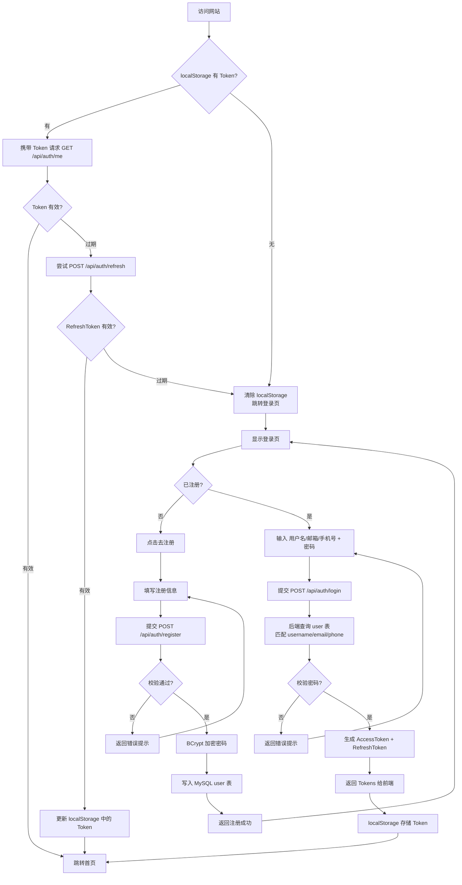

### 2.2 请求鉴权流程

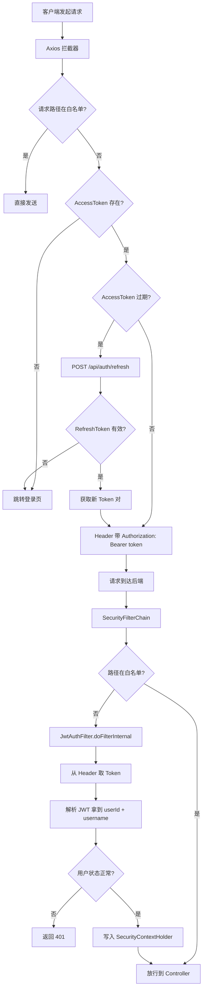

### 2.3 发帖流程（含图片上传）

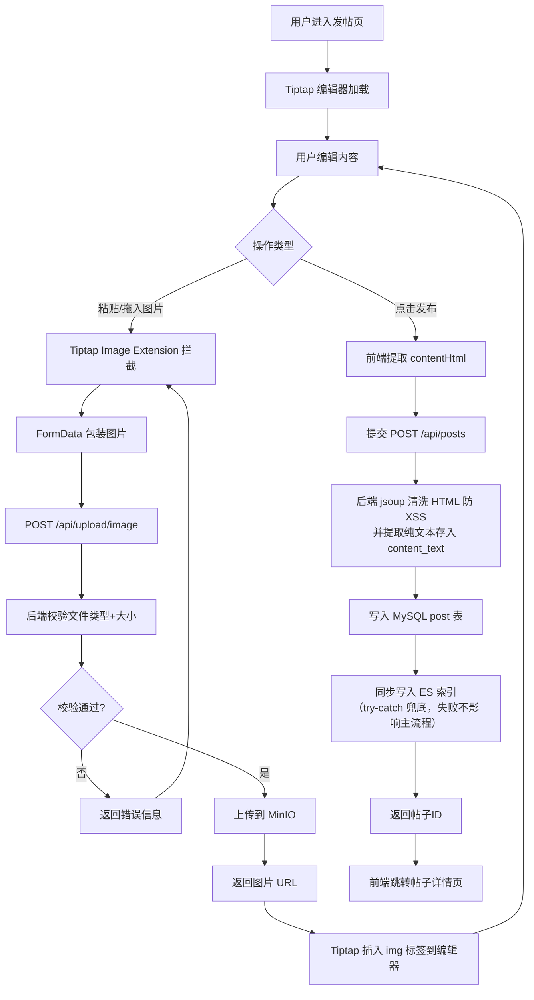

### 2.4 文件上传流程（MinIO / OSS 两阶段）

> 文件上传模块按部署阶段区分存储后端：第一阶段本地 MinIO，第二阶段切换阿里云 OSS。业务侧通过 `FileService` 接口统一抽象，`application.yml` 中 `storage.type` 配置项决定注入 `MinioFileServiceImpl` 还是 `OssFileServiceImpl`；上层调用方只依赖接口，无需感知底层实现。

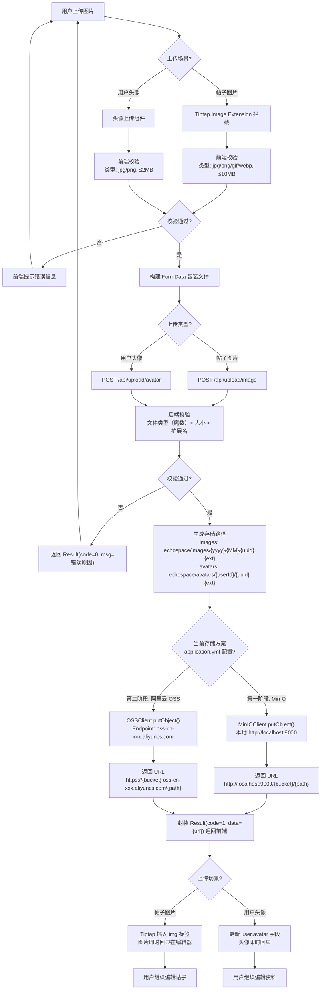

> **切换要点**：MinIO Java SDK 兼容 S3 协议，但阿里云 OSS 官方 Java SDK 使用自有 API 而非 S3 协议。因此不能简单通过改配置切换，需要在 Service 层定义 `FileService` 接口，分别提供 `MinioFileServiceImpl` 和 `OssFileServiceImpl` 两种实现，由 `storage.type` 配置决定注入哪个 Bean。已有图片数据通过 `mc mirror` 命令从 MinIO 同步到 OSS。

### 2.5 评论流程（一级评论 + 二级回复）

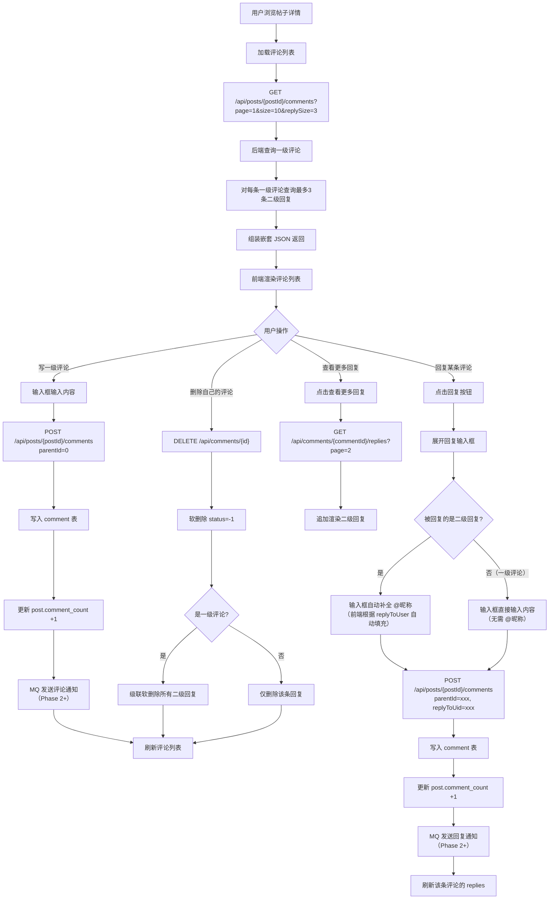

### 2.6 点赞/取消流程

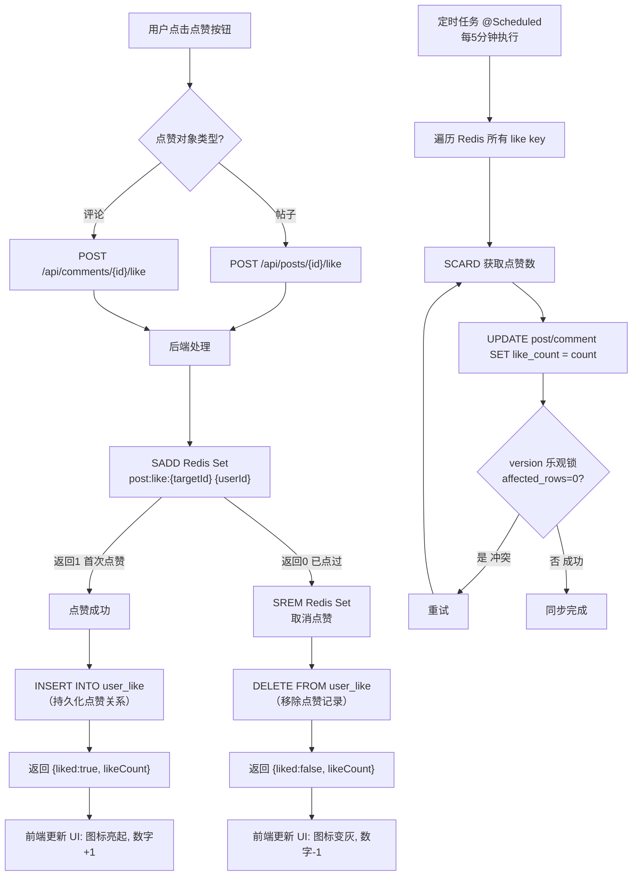

### 2.7 收藏/取消流程

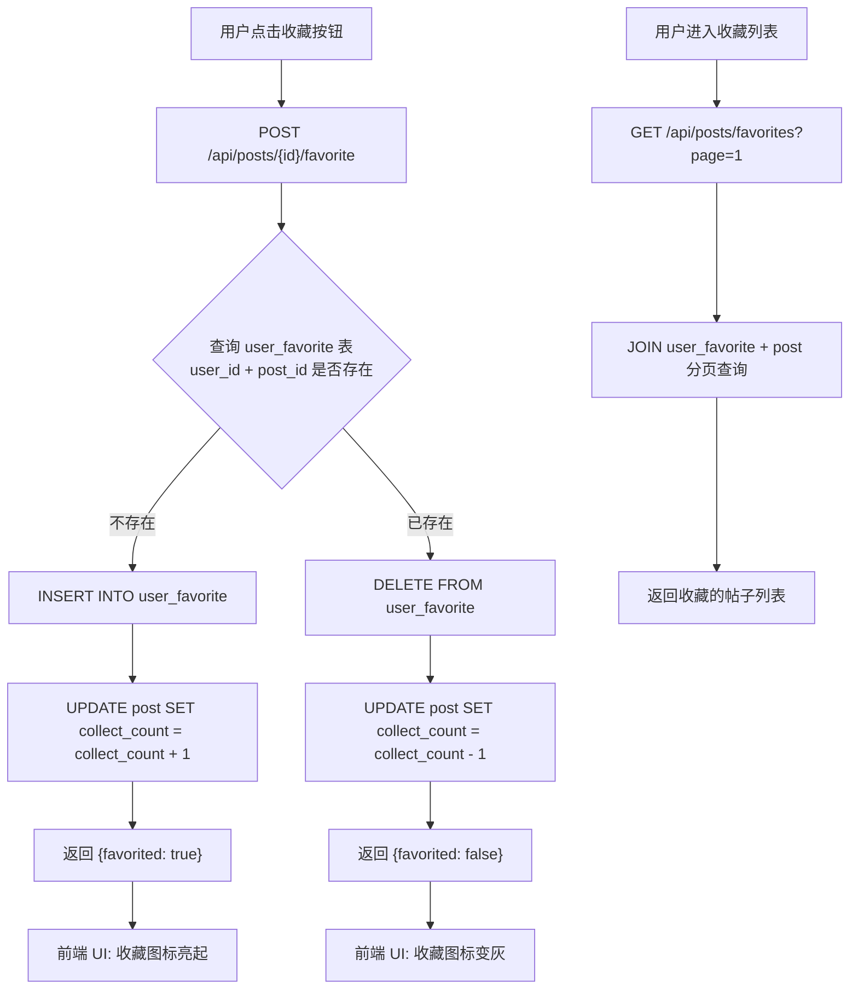

### 2.8 搜索流程

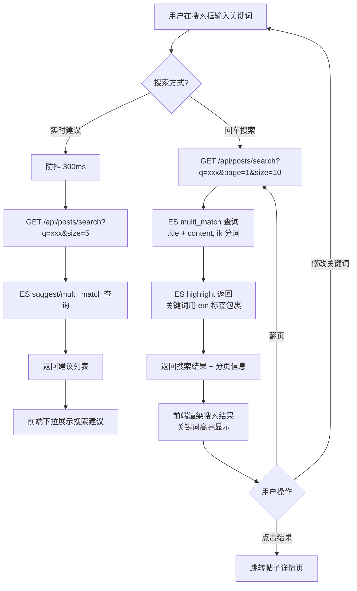

### 2.9 关注/取关流程

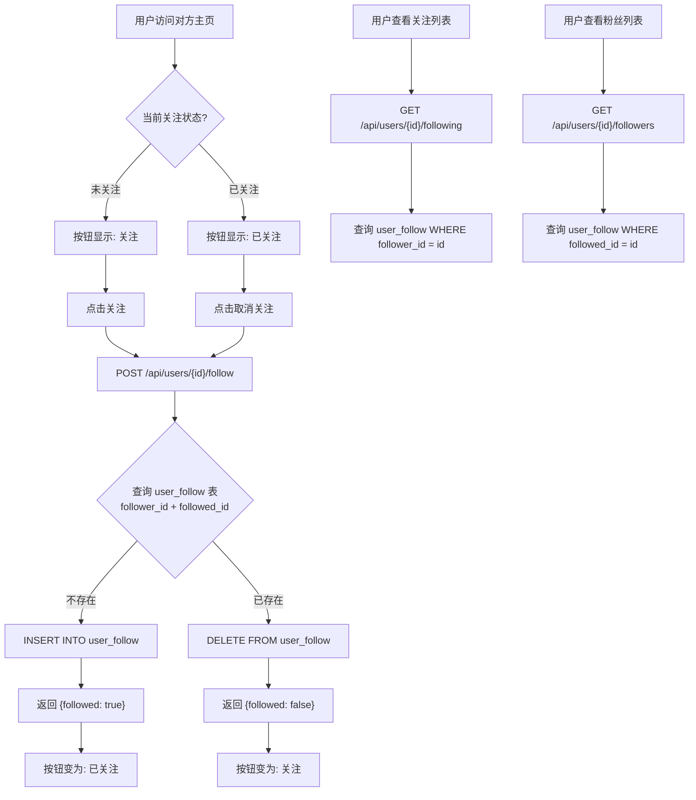

### 2.10 个人主页 + 时间线流程

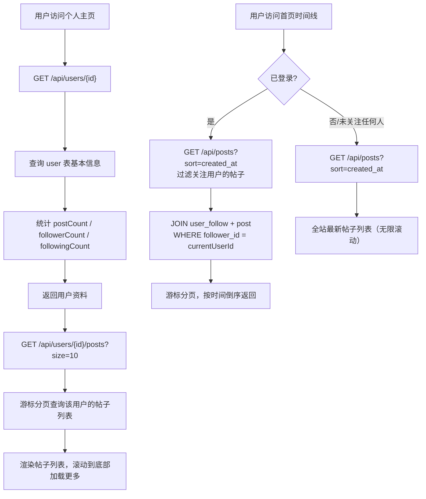

### 2.11 系统全景流程

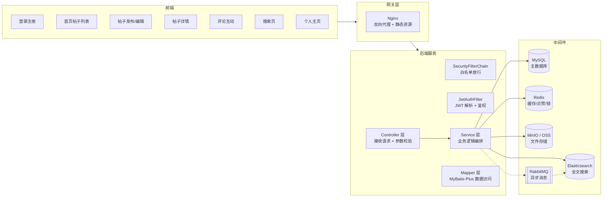

---

## 三、核心数据流向

### 3.1 写入路径（以发帖为例）

```text
用户 → Vue → Axios → Nginx → SecurityFilterChain → JwtAuthFilter
     → PostController → PostService
         ├─ HTML 清洗: jsoup 白名单过滤 + 提取纯文本
         ├─ 图片上传: FileService → MinIO → 返回 URL
         ├─ 数据写入: PostMapper → MySQL (post 表)
         ├─ 缓存失效: Redis DEL post:detail:{postId}
         └─ 搜索同步: RestClient → ES 索引（try-catch 兜底）
     → 返回 PostID → Vue 跳转详情页
```

### 3.2 读取路径（以帖子详情为例）

```text
用户 → Vue → Axios → Nginx → JwtAuthFilter
     → PostController → PostService
         ├─ 查 Redis: GET post:detail:{postId}
         │    ├─ 命中 → 直接返回
         │    └─ 未命中 ↓
         ├─ 查 MySQL: PostMapper.selectById(id)
         ├─ 查点赞状态: Redis SISMEMBER post:like:{postId} {userId}
         ├─ 查收藏状态: MySQL user_favorite
         ├─ 查关注状态: MySQL user_follow
         ├─ 写 Redis: SET post:detail:{postId} ... EX 600
         └─ 组装 PostDetailVO 返回
     → Vue 渲染详情页
```

### 3.3 点赞数据一致性策略

```text
┌─ 实时 ──────────────────────────────────────┐
│ Redis SADD/SREM (原子，毫秒级)               │
│ MySQL INSERT/DELETE user_like (持久化关系)    │
│ 前端即时展示点赞状态变更                     │
└────────────────────────────────────────────┘
         │
         ▼ (每5分钟)
┌─ 近实时同步 ────────────────────────────────┐
│ @Scheduled 定时任务                         │
│ SCARD 获取 Redis 点赞数                      │
│ UPDATE post/comment SET like_count = ?      │
│   WHERE id = ? AND version = ?              │
│ (乐观锁保证并发安全)                         │
└────────────────────────────────────────────┘
```

---

## 四、模块依赖关系

```mermaid
flowchart TD
    A[用户系统] --> B[帖子系统]
    A --> C[评论系统]
    A --> D[点赞系统]
    A --> E[收藏系统]
    A --> F[搜索系统]
    A --> G[关注系统]
    A --> H[通知系统]

    B --> C
    B --> D
    B --> E
    B --> F

    C --> D
    C --> H

    G --> I[时间线]
    I --> B

    D --> H

    B --> J[图片上传]
    J --> K[MinIO/OSS]

    B -.-> L[内容安全<br/>(Phase 3)]
    L -.-> B
```

> **说明**：箭头表示"依赖/使用"方向。例如帖子系统依赖用户系统（需要知道谁发的），评论依赖帖子（需要知道评论哪篇）。

---

## 五、接口与模块映射

完整接口定义见 [API 接口文档](./02-api-documentation.md)，此处仅做模块→接口的快速索引。

| 模块 | 涉及接口序号 | 接口数 |
|------|-------------|--------|
| 认证 | #1 ~ #4 | 4 |
| 用户 | #5 ~ #12 | 8 |
| 帖子 | #13 ~ #21 | 9 |
| 评论 | #22 ~ #26 | 5 |
| 文件上传 | #29 ~ #30 | 2 |

---

## 六、数据表与模块映射

完整表结构见 [数据库设计文档](./03-database-design.md)。

| 表名 | 关联模块 |
|------|----------|
| `user` | 认证、用户、关注 |
| `post` | 帖子、搜索、收藏 |
| `comment` | 评论、通知 |
| `user_like` | 点赞（帖子+评论通用） |
| `user_favorite` | 收藏 |
| `user_follow` | 关注 |
